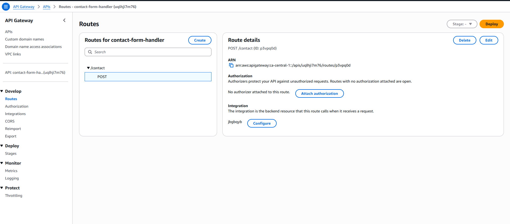

# AWS Serverless Contact Form


A serverless contact form backend built using **Amazon API Gateway, AWS Lambda, and DynamoDB**.  
This backend powers the **contact form on my portfolio website**, allowing users to submit messages that are processed by Lambda and stored in DynamoDB.

🌐 Live Portfolio  
https://dc61g20ci9ox4.cloudfront.net/

---

# Architecture Overview

This project uses a fully **serverless architecture**.

User → Portfolio Website → API Gateway → Lambda → DynamoDB → CloudWatch Logs

The system processes contact form submissions and securely stores them without managing any servers.

---

# AWS Services Used

- Amazon API Gateway
- AWS Lambda
- Amazon DynamoDB
- AWS IAM
- Amazon CloudWatch
- Amazon S3 (Portfolio hosting)
- Amazon CloudFront (Content delivery)

---

# Workflow

1. A user submits the contact form on the portfolio website.
2. The form sends a **POST request** to API Gateway.
3. API Gateway triggers **AWS Lambda**.
4. Lambda validates and processes the request.
5. Lambda stores the message in **DynamoDB**.
6. Logs are recorded in **CloudWatch Logs** for monitoring.

---

# API Gateway Configuration

API Gateway exposes an endpoint that receives the form submission.

### API Routes



### Lambda Integration


---

# Lambda Function

The Lambda function processes incoming requests and stores form data in DynamoDB.


Main responsibilities:

- Parse request body
- Validate form data
- Generate a unique ID
- Store message in DynamoDB
- Return success response

---

# DynamoDB Table

Contact form submissions are stored in a DynamoDB table.


Each submission includes:

- ID
- Name
- Email
- Message
- Timestamp

### Stored Items Example


---

# CloudWatch Logs

CloudWatch logs are used to monitor and troubleshoot Lambda execution.


Logs help identify errors and verify successful form submissions.

---

# Security Implementation

This project follows AWS security best practices:

- IAM role with **least privilege**
- Lambda allowed only **dynamodb:PutItem**
- Input validation inside Lambda
- Hidden honeypot field used in the contact form to reduce spam

---

# Challenges and Troubleshooting

## API Deployment Issue

Error: Unable to deploy API because no valid routes exist


Fix: Configured the correct **POST route and Lambda integration**.

---

## DynamoDB Permission Error

Error: AccessDeniedException: dynamodb:PutItem

Fix: Updated the **Lambda IAM role policy** to allow DynamoDB PutItem.

---

## API Testing Error

Error: Invoke-RestMethod : {"message":"Not Found"}

Fix: Used the correct **API Gateway invoke URL and route path**.

---

# Project Structure
```
aws-serverless-contact-form/
│
├── README.md
├── lambda_function.py
│
├── architecture/
│ └── architecture.png
│
├── screenshots/
│ ├── api-gateway-routes.png
│ ├── api-gateway-integration.png
│ ├── lambda.png
│ ├── dynamodb.png
│ ├── dynamodb-items.png
│ └── cloudwatch-logs.png
```
---

# Future Improvements

Planned enhancements:

- Email notifications using **Amazon SES**
- Input validation improvements
- Rate limiting
- CAPTCHA protection
- Monitoring using **CloudWatch Alarms**

---

# Key Learnings

- Building serverless APIs with API Gateway
- Integrating Lambda with DynamoDB
- Implementing IAM least privilege policies
- Debugging applications with CloudWatch logs
- Designing end-to-end serverless architectures

---

# Author

**Jayveersinh Vihol**

AWS Cloud Practitioner | Aspiring Cloud Engineer

Portfolio  
https://dc61g20ci9ox4.cloudfront.net/


