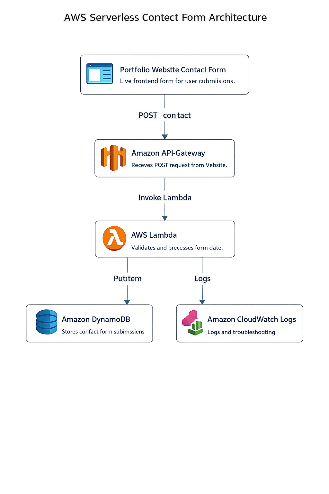
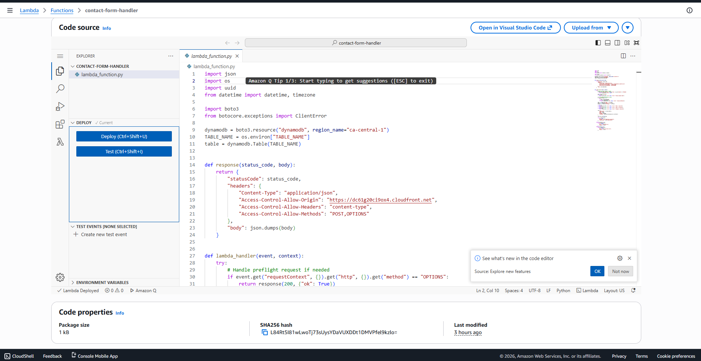
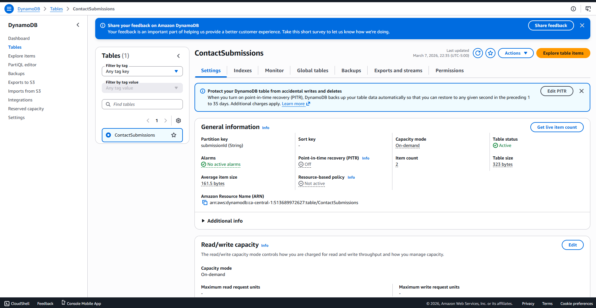
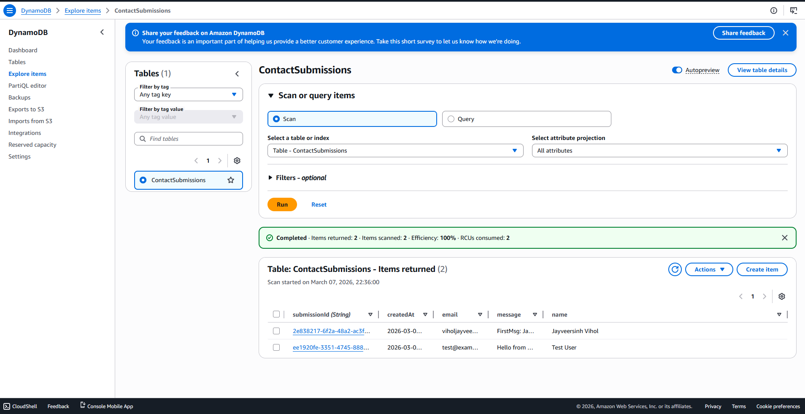
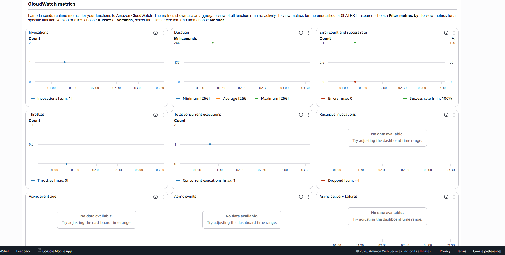

# AWS Serverless Contact Form

This project demonstrates a serverless backend for a contact form built using Amazon API Gateway, AWS Lambda, and DynamoDB.

The backend powers the contact form on my portfolio website, allowing users to submit messages which are processed by Lambda and stored in DynamoDB.

Live Portfolio  
https://dc61g20ci9ox4.cloudfront.net/

--------------------------------------------------

ARCHITECTURE OVERVIEW

The contact form follows a serverless architecture:

User → Portfolio Website → API Gateway → Lambda → DynamoDB → CloudWatch Logs

--------------------------------------------------

AWS SERVICES USED

* Amazon API Gateway  
* AWS Lambda  
* Amazon DynamoDB  
* AWS IAM  
* Amazon CloudWatch  
* Amazon S3 (Portfolio hosting)  
* Amazon CloudFront (Content delivery)

--------------------------------------------------

WORKFLOW

1. User submits contact form on the portfolio website
2. Form sends a POST request to API Gateway
3. API Gateway triggers AWS Lambda
4. Lambda validates and processes the request
5. Lambda stores the message in DynamoDB
6. Execution logs are stored in CloudWatch

--------------------------------------------------

API GATEWAY CONFIGURATION

API Gateway exposes an endpoint for the contact form submission.

API Gateway Routes Screenshot

API Gateway Lambda Integration Screenshot

--------------------------------------------------

LAMBDA FUNCTION

The Lambda function processes the request and stores the data in DynamoDB.

The function performs the following tasks:

- Parses request body
- Validates form input
- Generates unique submission ID
- Stores message in DynamoDB
- Returns success response

--------------------------------------------------

DYNAMODB TABLE

Contact form submissions are stored in a DynamoDB table.

Stored Items Example

Each submission includes:

ID  
Name  
Email  
Message  
Timestamp

--------------------------------------------------

CLOUDWATCH LOGS

CloudWatch logs are used for monitoring and troubleshooting Lambda execution.

--------------------------------------------------

SECURITY IMPLEMENTATION

This project follows AWS security best practices:

- IAM role with least privilege  
- Lambda allowed only dynamodb:PutItem  
- Input validation inside Lambda  
- Hidden honeypot field used in the contact form to reduce spam

--------------------------------------------------

CHALLENGES AND TROUBLESHOOTING

- API Deployment Issue

Error:
Unable to deploy API because no valid routes exist

Fix:
Configured proper POST route and Lambda integration.

- DynamoDB Permission Error

Error:
AccessDeniedException: dynamodb:PutItem

Fix:
Updated Lambda IAM role policy to allow DynamoDB PutItem.

- API Testing Error

Error:
Invoke-RestMethod : {"message":"Not Found"}

Fix:
Used the correct API Gateway invoke URL and route path.

--------------------------------------------------

PROJECT STRUCTURE

aws-serverless-contact-form

- lambda_function.py  
- architecture.png  
- API-Gateway-Routes.png  
- API-Gateway-Integration.png  
- Lambda.png  
- DynamoDB.png  
- dynamodb-items.png  
- cloudwatch-logs.png  

--------------------------------------------------

FUTURE IMPROVEMENTS

- Email notifications using Amazon SES  
- Input validation improvements  
- Rate limiting  
- CAPTCHA protection  
- Monitoring with CloudWatch alarms  

--------------------------------------------------

KEY LEARNINGS

- Building serverless APIs with API Gateway  
- Integrating Lambda with DynamoDB  
- IAM least privilege policies  
- Debugging using CloudWatch logs  
- End-to-end AWS serverless architecture  

--------------------------------------------------

AUTHOR

Jayveersinh Vihol

AWS Cloud Practitioner | Aspiring Cloud Engineer

Portfolio  
https://dc61g20ci9ox4.cloudfront.net/
